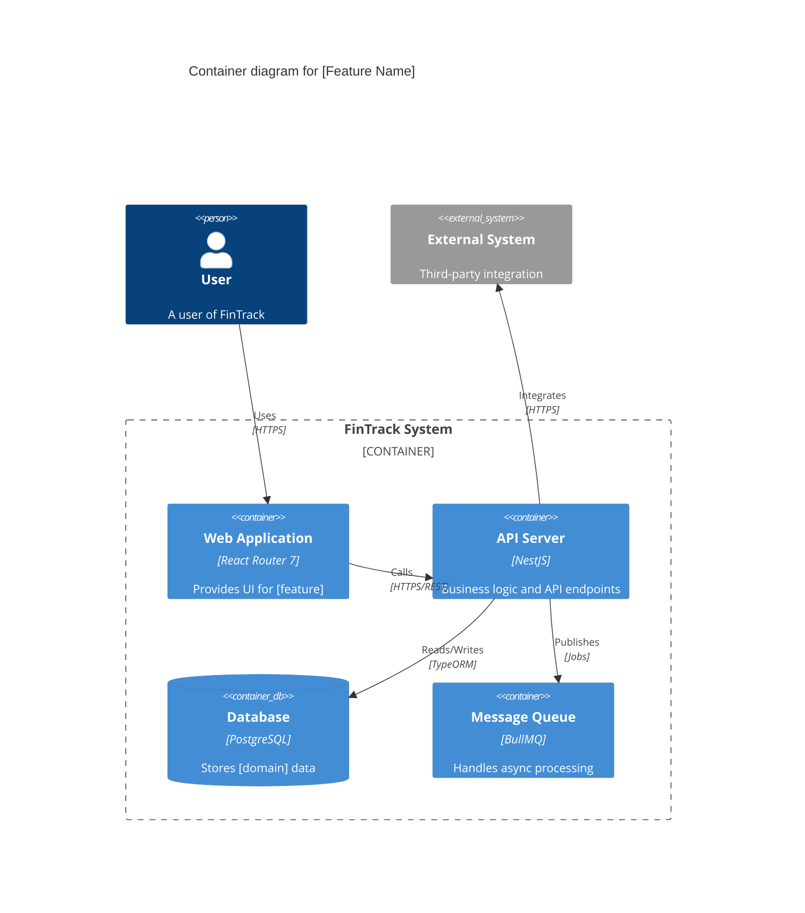

# Technical Investigation Workshop

You are facilitating a **collaborative technical investigation workshop using agent teams** to explore solution alternatives and document architectural decisions **before committing to implementation**.

This workshop follows **Thoughtworks' Architectural Risk Management (ARM) methodology** and uses **Risk Storming** to identify and mitigate architectural risks.

## Core Principles

- **Agent team collaboration**: Create a team of specialist agents who discuss, challenge, and refine ideas together
- **Risk-driven design**: Identify architectural characteristics and risks early to guide technical decisions
- **User interrogation**: Agents actively question the user to understand business strategy, constraints, and priorities
- **Visual architecture**: Create C4 Container diagrams to communicate the chosen architecture
- **Risk storming**: Identify architectural fragilities and mitigation strategies collaboratively
- **Document all paths**: Record both chosen and rejected alternatives with clear reasoning
- **Structured output**: Create comprehensive technical documentation in `apps/docs/docs/`

## Workshop Structure

This workshop uses **agent teams** (not subagents) where teammates work collaboratively, communicate directly with each other, and can interrogate the user for context.

### Workshop Team Roles

| Role | Expertise | Focus Areas |
|------|-----------|-------------|
| **Product Strategist** | Business alignment | Product vision, mission, strategic goals, business drivers |
| **Architect** | System design | Architectural characteristics, quality attributes, trade-offs |
| **Domain Modeler** | DDD | Domain modeling, bounded contexts, strategic design |
| **Database Specialist** | Data architecture | Data models, persistence, migrations, performance |
| **API Designer** | RESTful design | API contracts, HTTP semantics, resource modeling |
| **Devil's Advocate** | Contrarian thinking | Challenge assumptions, question decisions, test arguments, surface hidden risks |

### Methodology: Architectural Risk Management (ARM)

The workshop follows Thoughtworks' ARM methodology with four phases:

1. **Product/Business Strategy** - Identify product vision, mission, and strategic goals
2. **Prioritize Architectural Characteristics** - Map and rank architectural characteristics (quality attributes)
3. **Architecture Design** - Explore alternatives and choose solution
4. **Risk Storming** - Identify architectural risks and mitigation strategies

## Workflow

### Prerequisites: Gather Context

**Before starting the agent team, ask the user:**
- Problem description or feature name
- Link to product/project documentation (design docs, user stories, Figma URLs, GitHub issues)
- Any initial context about business drivers or technical constraints

**Confirm output location:**
```
apps/docs/docs/[where-should-this-go]
```

Default suggestions:
- Domain-specific: `domains/[domain]/technical-investigations/[feature-name].md`
- Frontend: `frontend/[feature]/technical-investigation.md`
- Infrastructure: `infrastructure/[feature]/technical-investigation.md`
- Integrations: `integrations/[integration]/[feature]/technical-investigation.md`

### Step 1: Create Agent Team

Create an agent team with the following teammates and team structure:

```text
Create an agent team for a technical investigation workshop following Architectural 
Risk Management methodology. The team will explore architecture alternatives, 
identify risks, and document decisions for:

[Include problem description and context from user]

Spawn 6 teammates with the following roles:

1. **Product Strategist** - Extract product vision, mission, and strategic goals 
   from the user. Identify business drivers and priorities.

2. **Architect** - Map business goals to architectural characteristics (performance, 
   scalability, security, etc.). Facilitate trade-off discussions.

3. **Domain Modeler** - Analyze domain boundaries, bounded contexts, aggregates, 
   and integration patterns. Explore DDD design alternatives.

4. **Database Specialist** - Design data models, persistence strategies, and 
   migration approaches. Analyze performance and scalability implications.

5. **API Designer** - Design REST API contracts, resource models, and integration 
   points. Ensure consistency with existing FinTrack patterns.

6. **Devil's Advocate** - Challenge assumptions from other agents, question 
   consensus, propose alternative scenarios, and test argument robustness. 
   Focus on strengthening decisions through constructive criticism.

All teammates should:
- Interrogate the user extensively to gather context
- Challenge each other's assumptions
- Discuss and debate design alternatives
- Document their findings collaboratively

The Devil's Advocate should specifically:
- Question assumptions made by other agents
- Challenge consensus reached too quickly
- Surface hidden risks and uncomfortable truths
- Test the robustness of arguments with evidence
- Always provide constructive alternatives when challenging ideas

Team lead should:
- Coordinate the ARM methodology phases
- Synthesize findings into a technical investigation document
- Facilitate Risk Storming session at the end
- Create C4 Container diagram of chosen architecture
```

**Important**: Agent teams require `CLAUDE_CODE_EXPERIMENTAL_AGENT_TEAMS=1` environment variable.

### Step 2: Phase 1 - Product/Business Strategy (Product Strategist)

The **Product Strategist teammate** should interrogate the user to understand:

**Questions to ask the user:**
1. **Product Vision**: "What is the product's vision? What does success look like in 1-2 years?"
2. **Product Mission**: "What is the product's mission? What problem are we solving for users?"
3. **Strategic Goals**: "Choose the top 5 strategic goals for this product right now:
   - Increase profit
   - Improve customer retention
   - Improve security
   - Improve time to market
   - Diversify or create new revenue streams
   - Reduce operational costs
   - Improve scalability
   - Improve developer experience
   - Other: [specify]"

**Output**: Document the product's vision, mission, and top strategic goals.

### Step 3: Phase 2 - Prioritize Architectural Characteristics (Architect)

The **Architect teammate** should:

1. **Map architectural characteristics** from business goals identified in Phase 1
2. **Ask the user to prioritize** the following architectural characteristics:

**Common architectural characteristics:**
- **Performance** - Response time, throughput, latency
- **Scalability** - Ability to handle growth in users/data
- **Availability** - System uptime, fault tolerance
- **Security** - Authentication, authorization, data protection
- **Maintainability** - Code quality, testability, modularity
- **Deployability** - Ease of deployment, rollback, CI/CD
- **Observability** - Monitoring, logging, tracing, debugging
- **Extensibility** - Ability to add new features
- **Interoperability** - Integration with external systems
- **Cost** - Infrastructure and operational costs
- **Time to Market** - Speed of feature delivery
- **Data Integrity** - Consistency, durability, correctness
- **Usability** - User experience, accessibility
- **Testability** - Ease of testing, test coverage

**Process:**
1. Identify top 7 characteristics based on business goals
2. Among these 7, identify the **top 3 driving characteristics**
3. Identify **implicit characteristics** (not specified by business but technically necessary)
4. Mark characteristics that are **not priorities** at this moment

**Ask the user:**
- "Based on the strategic goals, which architectural characteristics matter most?"
- "If you had to choose only 3 non-negotiable characteristics, what would they be?"
- "Are there trade-offs you're willing to accept?" (e.g., "favor time to market over perfect scalability initially")

**Output**: Prioritized list of architectural characteristics with clear top 3.

### Step 4: Phase 3 - Architecture Design (All Technical Teammates)

Now the **Domain Modeler, Database Specialist, and API Designer** collaborate to explore solution alternatives.

#### 4.1 Domain Analysis (Domain Modeler)

**Domain Modeler** explores domain design alternatives and asks:
- "Which existing bounded contexts are affected?"
- "Should this be a new bounded context or extend an existing one?"
- "What are the core domain concepts (aggregates, entities, value objects)?"
- "Are domain events needed for async communication?"
- "What are the integration patterns with other contexts?" (Customer-Supplier, ACL, Shared Kernel)

**Explore 2-3 domain design alternatives** (e.g., single vs multiple bounded contexts, event-driven vs synchronous).

**Ask the user:**
- "Which bounded context structure aligns best with your mental model?"
- "Do you prefer eventual consistency (events) or immediate consistency (synchronous)?"
- "Are there any domain concepts that need clarification?"

#### 4.2 Data Model Analysis (Database Specialist)

**Database Specialist** explores persistence alternatives and asks:
- "What are the expected read/write patterns?" (read-heavy, write-heavy, balanced)
- "What query patterns will be most common?"
- "What's the expected data scale?" (rows, growth rate)
- "Are there data compliance requirements?" (GDPR, retention)
- "What's your tolerance for migration complexity?"

**Explore 2-3 data model alternatives** (e.g., normalized vs denormalized, caching strategies).

**For each alternative, document:**
- Schema changes required
- Performance implications
- Migration complexity (breaking vs non-breaking)
- Indexing strategy
- Pros and cons

#### 4.3 API Design Analysis (API Designer)

**API Designer** explores API contract alternatives and asks:
- "Do clients need fine-grained control (many small operations) or simplicity (fewer large operations)?"
- "Are there API contract constraints from consumers?"
- "What's your backward compatibility requirement?"
- "Should this be synchronous (REST) or asynchronous (events)?"

**Explore 2-3 API design alternatives** (e.g., resource nesting, granularity, versioning).

**For each alternative, document:**
- Endpoint specifications
- Request/response schemas
- Error handling approach
- Consistency with existing FinTrack API patterns
- Pros and cons

#### 4.4 Collaborative Decision Making

**All teammates** should:
- Share their findings with each other
- Debate trade-offs across domain, data, and API layers
- Challenge assumptions
- Converge on a **recommended solution**

**The Architect** synthesizes the discussion and asks the user:
- "Here are 2-3 complete solution alternatives [summarize]. Which aligns best with your priorities?"
- "What concerns do you have about the recommended approach?"
- "Are there any non-negotiable constraints we're missing?"

**Output**: Chosen architecture with clear alternatives explored and rejection reasons.

### Step 5: Phase 4 - Create C4 Container Diagram (Architect)

Once the architecture is chosen, the **Architect** creates a **C4 Container diagram** showing:

**Container diagram elements:**
- **Containers** within the FinTrack system (web app, API server, databases, queues, caches)
- **External systems** the feature interacts with (third-party APIs, auth providers)
- **Communication paths** between containers (HTTP, events, database connections)
- **Technology choices** for each container (React Router, NestJS, PostgreSQL, Redis, BullMQ)

**Use Mermaid C4 diagram syntax:**



**Include in the diagram:**
- Key containers involved in the feature
- External dependencies
- Communication protocols
- Technology stack choices

**Output**: C4 Container diagram embedded in the technical investigation document.

### Step 6: Phase 5 - Risk Storming Session (All Teammates)

Now conduct a **Risk Storming session** to identify architectural risks collaboratively.

#### Risk Storming Process

**Step 6.1: Individual Risk Identification (All teammates)**

Each teammate **individually** (in parallel) identifies risks in the chosen architecture:

**Risk categories to consider:**
- **Availability**: Single points of failure, external system outages, cascading failures
- **Performance**: Slow components, N+1 queries, inefficient algorithms, network latency
- **Scalability**: Components that won't scale, database bottlenecks, memory leaks
- **Security**: Authentication bypasses, authorization flaws, data exposure, injection attacks
- **Data Integrity**: Data corruption, consistency issues, lost updates, race conditions
- **Operational**: Deployment complexity, monitoring gaps, difficult debugging
- **Technology**: Unproven technology, framework limitations, library bugs
- **Team**: Skill gaps, knowledge silos, unfamiliarity with patterns
- **Integration**: Third-party API changes, versioning issues, contract mismatches
- **Migration**: Breaking changes, downtime, rollback complexity

**For each risk, assess:**
- **Probability**: Low (1), Medium (2), High (3) - How likely is it to occur?
- **Impact**: Low (1), Medium (2), High (3) - What's the consequence if it occurs?
- **Priority Score**: Probability × Impact (1-9)
  - **High priority (6-9)**: Red - must address
  - **Medium priority (3-4)**: Yellow - should address
  - **Low priority (1-2)**: Green - monitor

**Step 6.2: Converge Risks (Team Lead)**

The **team lead** collects all risks from teammates and:
- Groups similar risks identified by multiple teammates
- Highlights risks identified by only one person
- Notes disagreements on probability/impact assessments

**Step 6.3: Review with User (All teammates + User)**

Present the risk matrix to the user:

```
Risk Matrix (by area on C4 diagram):

[Container/Component Name]
├─ HIGH PRIORITY (red)
│  ├─ Risk 1: [description] (P: 3, I: 3, Score: 9)
│  └─ Risk 2: [description] (P: 3, I: 2, Score: 6)
├─ MEDIUM PRIORITY (yellow)
│  └─ Risk 3: [description] (P: 2, I: 2, Score: 4)
└─ LOW PRIORITY (green)
   └─ Risk 4: [description] (P: 1, I: 2, Score: 2)
```

**Ask the user:**
- "Do these risks match your concerns?"
- "Are we missing any critical risks?"
- "Do you disagree with any probability/impact assessments?"
- "Which high-priority risks concern you most?"

**Step 6.4: Define Mitigation Strategies (All teammates)**

For each **HIGH and MEDIUM priority risk**, the teammates collaborate to define mitigation strategies:

**Mitigation strategy types:**
- **Prevention**: Change architecture to eliminate the risk (e.g., remove single point of failure)
- **Detection**: Add monitoring/alerting to catch the risk early (e.g., circuit breakers, health checks)
- **Recovery**: Add mechanisms to recover from the risk (e.g., retries, fallbacks, graceful degradation)
- **Acceptance**: Document the risk and accept it with clear reasoning (e.g., low probability + mitigation cost too high)

**For each high-priority risk, document:**
- **Mitigation approach** (prevention/detection/recovery/acceptance)
- **Specific actions** (code changes, infrastructure, monitoring)
- **Implementation timing** (before MVP, phase 2, ongoing)
- **Responsible team/role**

**Ask the user:**
- "Are these mitigation strategies acceptable?"
- "What's your risk tolerance for [specific risk]?"
- "Which mitigations must be in MVP vs can wait?"

**Output**: Comprehensive risk register with risks categorized by C4 Container diagram areas, prioritized, and with mitigation strategies.

### Step 7: Cross-Cutting Concerns Discussion (All teammates + User)

**Prompt user for additional technical aspects:**

1. **Authentication & Authorization**
   - "Who can access this feature?" (roles, permissions)
   - "Are there row-level security needs?"

2. **Observability**
   - "What metrics matter most?" (latency, throughput, error rate)
   - "What events should be logged for debugging?"
   - "Are there any SLOs/SLAs to meet?"

3. **Testing Strategy**
   - "What's the testing priority?" (unit, integration, E2E)
   - "Are there any critical test scenarios?"

4. **Error Handling**
   - "What failure modes must be gracefully handled?"
   - "Are retries appropriate?"

5. **Performance Targets**
   - "What are the performance targets?" (latency, throughput)
   - "What's the expected scale?" (requests/sec, data volume)

### Step 8: Synthesize Technical Investigation Document (Team Lead)

The **team lead** creates the technical investigation document in the confirmed location.

**Document structure:**

```markdown
---
sidebar_position: [auto-increment]
title: Technical Investigation - [Feature Name]
date: [YYYY-MM-DD]
---

# Technical Investigation: [Feature Name]

## Executive Summary

### Problem Statement
[1 paragraph: what problem are we solving?]

### Chosen Solution
[1 paragraph: high-level architecture approach]

### Key Decisions
- [Decision 1]
- [Decision 2]
- [Decision 3]

---

## Phase 1: Product/Business Strategy

### Product Vision
[Vision statement]

### Product Mission
[Mission statement]

### Strategic Goals (Top 5)
1. [Goal 1]
2. [Goal 2]
3. [Goal 3]
4. [Goal 4]
5. [Goal 5]

---

## Phase 2: Architectural Characteristics

### Prioritized Characteristics

**Top 3 Driving Characteristics:**
1. **[Characteristic 1]** - [Why it's critical for business goals]
2. **[Characteristic 2]** - [Why it's critical for business goals]
3. **[Characteristic 3]** - [Why it's critical for business goals]

**Other Important Characteristics (4-7):**
- [Characteristic 4]
- [Characteristic 5]
- [Characteristic 6]
- [Characteristic 7]

**Implicit Characteristics:**
- [Characteristic] - [Why it's necessary even if not business-driven]

**Not Priorities at This Time:**
- [Characteristic] - [Why deprioritized]

**Trade-offs Accepted:**
- [Trade-off 1: favor X over Y because...]
- [Trade-off 2: accept limitation in Z to achieve W]

---

## Phase 3: Architecture Design

### Solution Alternatives Explored

#### Domain Design Alternatives

**Alternative 1: [Name]**
- **Description**: [How it works]
- **Bounded Contexts**: [Which contexts, new vs existing]
- **Integration Pattern**: [Sync vs async, events, etc.]
- **Pros**:
  - [Pro 1]
  - [Pro 2]
- **Cons**:
  - [Con 1]
  - [Con 2]
- **Why rejected/chosen**: [Clear reasoning]

**Alternative 2: [Name]**
[Same structure]

**Alternative 3: [Name]** (if applicable)
[Same structure]

**✅ Chosen: [Alternative X]**
- **Reasoning**: [Why this alternative was selected based on architectural characteristics and business goals]

---

#### Data Model Alternatives

**Alternative 1: [Name]**
- **Description**: [Schema approach]
- **Migration Complexity**: [Breaking/non-breaking, steps required]
- **Performance Characteristics**: [Read/write optimization, indexing]
- **Pros**:
  - [Pro 1]
  - [Pro 2]
- **Cons**:
  - [Con 1]
  - [Con 2]
- **Why rejected/chosen**: [Clear reasoning]

**Alternative 2: [Name]**
[Same structure]

**✅ Chosen: [Alternative X]**
- **Reasoning**: [Why selected]

---

#### API Design Alternatives

**Alternative 1: [Name]**
- **Description**: [Endpoint structure, granularity]
- **Endpoints**:
  - `GET /resource` - [Description]
  - `POST /resource` - [Description]
- **Consistency with FinTrack patterns**: [How it aligns]
- **Backward compatibility**: [Breaking/non-breaking]
- **Pros**:
  - [Pro 1]
  - [Pro 2]
- **Cons**:
  - [Con 1]
  - [Con 2]
- **Why rejected/chosen**: [Clear reasoning]

**Alternative 2: [Name]**
[Same structure]

**✅ Chosen: [Alternative X]**
- **Reasoning**: [Why selected]

---

### Chosen Architecture

#### C4 Container Diagram

```mermaid
[Paste C4 Container diagram created by Architect]
```

**Key Architectural Decisions:**
- **Containers involved**: [List containers and their responsibilities]
- **Technology choices**: [Why these technologies]
- **Communication patterns**: [Sync/async, protocols]
- **External dependencies**: [Third-party systems, implications]

#### Domain Design

**Bounded Contexts Affected:**
- **[Context 1]**: [Responsibility, changes required]
- **[Context 2]**: [Responsibility, changes required]

**Aggregates and Entities:**
- **[Aggregate 1]**:
  - Root: [Entity]
  - Entities: [List]
  - Value Objects: [List]
  - Invariants: [Business rules to enforce]

**Domain Events** (if any):
- **[Event 1]**: When [trigger], published by [aggregate], consumed by [subscriber]

**Integration Patterns:**
- [Context A] → [Context B]: [Pattern (e.g., Customer-Supplier, ACL)]

#### Data Model

**Entity Designs:**
```typescript
// [Entity 1]
interface [Entity1] {
  // Fields, types, constraints
}
```

**Relationships:**
- [Entity A] → [Entity B]: [Relationship type (1:1, 1:N, N:M)]

**Indexing Strategy:**
- Index on `[field]`: [Reason (query pattern, performance)]

**Migration Approach:**
- **Breaking changes**: [Yes/No, details]
- **Migration steps**: [Step-by-step plan]
- **Rollback strategy**: [How to undo if needed]

#### API Contracts

**Endpoints:**

```http
GET /api/v1/[resource]
```
**Request:**
```json
{
  "param": "value"
}
```
**Response:**
```json
{
  "data": {}
}
```
**Error Handling:**
- `400`: [When, response structure]
- `404`: [When, response structure]
- `500`: [When, response structure]

[Repeat for each endpoint]

#### Cross-Cutting Concerns

**Authentication & Authorization:**
- **Who can access**: [Roles, permissions]
- **Row-level security**: [Yes/No, how implemented]

**Observability:**
- **Key metrics**: [Metric 1, Metric 2]
- **Logging**: [What to log, log levels]
- **Tracing**: [Distributed tracing needs]
- **SLOs**: [Performance targets, error budgets]

**Testing Strategy:**
- **Unit tests**: [Coverage targets, critical paths]
- **Integration tests**: [Key scenarios]
- **E2E tests**: [User journeys]

**Error Handling:**
- **Graceful degradation**: [How system behaves under failure]
- **Retries**: [When and how]
- **Fallbacks**: [Alternative paths]

**Performance:**
- **Targets**: [Latency p95, throughput]
- **Expected scale**: [Requests/sec, data volume]
- **Bottleneck mitigation**: [Caching, optimization strategies]

---

## Phase 4: Risk Storming Results

### Risk Matrix Summary

**High Priority Risks (Score 6-9):** [Count]  
**Medium Priority Risks (Score 3-4):** [Count]  
**Low Priority Risks (Score 1-2):** [Count]

### Risks by Container/Component

#### [Container/Component 1]

**🔴 High Priority Risks**

##### Risk 1: [Risk Name]
- **Description**: [What could go wrong]
- **Probability**: [Low/Medium/High (1-3)]
- **Impact**: [Low/Medium/High (1-3)]
- **Priority Score**: [1-9]
- **Mitigation Strategy**:
  - **Type**: [Prevention/Detection/Recovery/Acceptance]
  - **Actions**:
    - [Action 1]
    - [Action 2]
  - **Timing**: [Before MVP/Phase 2/Ongoing]
  - **Owner**: [Team/Role]

**🟡 Medium Priority Risks**

##### Risk 2: [Risk Name]
[Same structure]

**🟢 Low Priority Risks**

##### Risk 3: [Risk Name]
[Same structure]

---

#### [Container/Component 2]
[Same structure for risks in this container]

---

### Risk Acceptance Log

**Risks Accepted (Not Mitigated):**
- **[Risk Name]**: [Why accepted, probability, impact, justification]

---

## Technical Decisions Summary

### Significant Decisions Made
1. **[Decision 1]**: [What was decided, why]
2. **[Decision 2]**: [What was decided, why]
3. **[Decision 3]**: [What was decided, why]

### Related ADRs
- [ADR-XXX]: [Title] - [When to create]

### Assumptions and Constraints
- **Assumption 1**: [What we assume to be true]
- **Constraint 1**: [Technical or business limitation]

---

## Next Steps

### Recommended Implementation Order
1. **Phase 1**: [What to build first, why]
2. **Phase 2**: [What to build next, dependencies]
3. **Phase 3**: [What can wait, why]

### Prerequisites or Blockers
- [Prerequisite 1]: [What needs to happen first]
- [Blocker 1]: [What's blocking progress]

### Suggested ADRs to Create
- [ADR topic 1]: [What decision needs formal recording]
- [ADR topic 2]: [What decision needs formal recording]

### Suggested Follow-up Workshops
- **[Workshop type]**: [When needed, why]

---

## Appendix

### Workshop Participants
- Product Strategist: [Agent]
- Architect: [Agent]
- Domain Modeler: [Agent]
- Database Specialist: [Agent]
- API Designer: [Agent]
- Devil's Advocate: [Agent]
- User: [Name]

### References
- [Link to related docs, Figma, GitHub issues]
- Architectural Risk Management: [Thoughtworks article]
- Risk Storming: [riskstorming.com]
- C4 Model: [c4model.com]

### Glossary
- **[Term 1]**: [Definition]
- **[Term 2]**: [Definition]
```

**Ensure Docusaurus frontmatter is included.**

If creating new directory structure, create `_category_.json` for navigation.

### Step 9: Review and Finalize (All teammates + User)

1. **Present document to user**
2. **All teammates** provide feedback and challenge each other's sections
3. **Ask user for final validation:**
   - "Does this capture all alternatives we discussed?"
   - "Are the risk priorities and mitigations acceptable?"
   - "Is the C4 diagram clear and accurate?"
   - "Are the rejection reasons clear and defensible?"
   - "Is anything missing from the chosen solution?"
4. **Update document based on feedback**
5. **Confirm completeness**

### Step 10: Clean Up Agent Team

When the workshop is complete:

1. **Ask all teammates to shut down gracefully**
2. **Team lead runs cleanup** to remove shared team resources

```text
Thank you all for the collaboration. Please shut down now.
```

Wait for all teammates to confirm shutdown, then:

```text
Clean up the team
```

**⚠️ Important**: Always use the team lead to clean up, never teammates.

### Step 11: Suggest Next Actions

**Recommend to user:**

1. **If ready for detailed design:**
   ```
   Use the design-doc skill to create a full design document:
   /design-doc [link to this technical investigation]
   ```

2. **If ADRs needed:**
   ```
   Create ADRs for:
   - [Decision 1]
   - [Decision 2]
   ```

3. **If ready to implement:**
   ```
   Use the task-planning skill to break down into user stories:
   /task-planning [link to this technical investigation]
   ```

4. **If more investigation needed:**
   ```
   Run another technical workshop focused on:
   - [Specific area that needs more exploration]
   ```

## Interactive Prompting Best Practices

Throughout the workshop, **all teammates** should actively interrogate the user with structured questions:

### For Business Strategy (Product Strategist)
- "What does success look like for this product in 1-2 years?"
- "If you could only achieve one business goal this year, what would it be?"
- "What's the biggest business risk if we don't deliver this feature?"
- "Who are the key stakeholders and what do they care about most?"

### For Architectural Characteristics (Architect)
- "If the system is slow but highly secure, is that acceptable?"
- "If we have to choose between fast delivery and perfect scalability, which wins?"
- "What's your definition of 'good enough' performance?" (e.g., "< 200ms p95 latency")
- "What scale do you expect in 6 months? 1 year? 3 years?"
- "What's the worst case scenario we need to handle gracefully?"

### For Design Choices (All technical teammates)
- "Here are three alternatives: [A], [B], [C]. Which aligns best with your mental model?"
- "Trade-off: [Option A] gives X but costs Y. [Option B] gives Z but costs W. Which matters more?"
- "Do you prefer [simpler but less flexible] or [more complex but adaptable]?"
- "How would you explain this feature to a non-technical stakeholder?"

### For Risk Assessment (Risk Analyst + User)
- "What keeps you up at night about this architecture?"
- "If this system failed in production, what would be the impact on the business?"
- "Are we over-engineering or under-engineering this solution?"
- "What assumptions are we making that could be wrong?"
- "What would make you confident this solution will work?"

### For Prioritization (Architect + Product Strategist)
- "If you had to cut scope, which part could wait for v2?"
- "What's the riskiest assumption we should validate first?"
- "Which quality attribute is non-negotiable: [performance / security / simplicity]?"
- "What's the minimum viable architecture to validate the concept?"

## Agent Team Best Practices

### Encourage Cross-Agent Discussion
- Teammates should challenge each other's assumptions
- Use the shared task list to coordinate work
- Message each other directly to debate trade-offs
- Avoid working in silos - collaborate frequently

### Examples of Good Collaboration:
```text
Domain Modeler → Database Specialist:
"I'm proposing separate bounded contexts for Accounts and Transactions. 
Does this create data duplication issues in your schema design?"

Database Specialist → API Designer:
"The normalized schema I'm proposing requires 3 JOINs for the main query. 
Does that affect your API response time targets?"

Architect → All Teammates:
"We said scalability is our top priority, but I'm seeing designs that favor 
simplicity over scale. Are we aligned on this trade-off?"
```

### Team Lead Responsibilities
- Coordinate the ARM methodology phases sequentially
- Synthesize findings from all teammates
- Ensure user interrogation happens throughout
- Facilitate Risk Storming convergence
- Create final technical investigation document
- Manage team lifecycle (spawn, coordinate, cleanup)

### Teammate Responsibilities
- Interrogate the user extensively in your area of expertise
- Share findings with other teammates
- Challenge other teammates' assumptions
- Contribute to Risk Storming with your perspective
- Document your analysis clearly for synthesis

## Anti-Patterns to Avoid

| Anti-Pattern | Problem | Fix |
|--------------|---------|-----|
| **Solution jumping** | Picking first solution without exploring alternatives | Always generate 2-3 alternatives per decision point |
| **Shallow rejection reasoning** | "We rejected X because we chose Y" (circular) | Document specific pros/cons that led to rejection |
| **Missing user input** | Making technical decisions without user validation | Teammates must interrogate user extensively throughout |
| **Document only chosen path** | No record of alternatives explored | Document ALL alternatives considered, even brief ones |
| **Skipping ARM phases** | Jumping to architecture without understanding business strategy | Follow ARM methodology: Strategy → Characteristics → Design → Risk Storming |
| **Using subagents instead of teams** | Teammates can't collaborate or discuss | Use agent teams with `CLAUDE_CODE_EXPERIMENTAL_AGENT_TEAMS=1` |
| **Silent teammates** | Teammates work in isolation without discussion | Encourage cross-agent messaging and debate |
| **No C4 diagram** | Architecture not visualized clearly | Always create C4 Container diagram before Risk Storming |
| **Skipping Risk Storming** | Risks not identified or deprioritized | Conduct full Risk Storming session with all teammates |
| **Ignoring risk mitigation** | Identifying risks without mitigation strategies | Every high/medium risk needs specific mitigation plan |
| **Risk assessment without user** | Probability/impact decided by agents alone | User must validate all high-priority risks |
| **Premature architecture commitment** | Choosing architecture before understanding business goals | Complete Strategy and Characteristics phases first |
| **One-way decisions** | Not revisiting earlier decisions as new info emerges | Allow backtracking if later insights change earlier choices |
| **Lead doing implementation** | Team lead writes code instead of coordinating | Lead synthesizes, teammates investigate |
| **Not cleaning up team** | Leaving agent team resources orphaned | Always shut down teammates and run cleanup |

## Reference Materials

### Methodologies
- **Architectural Risk Management (ARM)**: [arm-methodology.md](./references/arm-methodology.md) - Complete guide to Thoughtworks' ARM methodology
- **Risk Storming**: [risk-storming.md](./references/risk-storming.md) - Step-by-step guide to collaborative risk identification
- **C4 Model**: [c4-container-diagrams.md](./references/c4-container-diagrams.md) - How to create effective C4 Container diagrams

### External References
- [Thoughtworks ARM Article](https://www.thoughtworks.com/en-br/insights/blog/architecture/architectural-risk-management)
- [Risk Storming Website](https://riskstorming.com/)
- [C4 Model Website](https://c4model.com/)
- [Claude Code Agent Teams](https://code.claude.com/docs/en/agent-teams)

### Agent Specifications
- [Devil's Advocate Agent](../../agents/devils-advocate/devils-advocate.md) - Full agent specification

### Document Templates
- Document structure template: `references/document-structure.md`
- C4 diagram patterns: See C4 Model website for Mermaid syntax

## Related Skills

- **design-doc** - Full design document after investigation
- **task-planning** - Breaking down chosen solution into user stories
- **implement-story** - Implementing the planned work
- **event-storming** - Domain event discovery workshops

---

## Usage Example

```
User: Let's investigate technical options for adding recurring transactions

Agent (Team Lead):
1. Gathers context from user (problem description, links, constraints)
2. Confirms output location: apps/docs/docs/domains/transactions/technical-investigations/recurring-transactions.md
3. Creates agent team with 6 teammates:
   - Product Strategist
   - Architect
   - Domain Modeler
   - Database Specialist
   - API Designer
   - Devil's Advocate

4. **Phase 1: Product/Business Strategy**
   Product Strategist → User:
   - "What's the product vision for the transactions feature?"
   - "What are your top 5 strategic goals right now?"
   
   Devil's Advocate → Product Strategist:
   - "Goal is 'improve time to market.' What's current time to market? What's acceptable?"
   - "These 5 goals seem equally weighted. If we had to sacrifice one, which would it be?"
   
   Agent documents: Vision, mission, strategic goals

5. **Phase 2: Prioritize Architectural Characteristics**
   Architect → User:
   - "Based on these goals, should we prioritize time to market or perfect scalability?"
   - "What's more important: consistency or availability for recurring transactions?"
   
   Devil's Advocate → Architect:
   - "We prioritized Performance. But if users churn due to bugs shipped fast, doesn't that hurt retention (goal #2)?"
   - "Trade-off says 'favor time to market over scalability.' What's 'good enough' scalability? 100 users? 10K?"
   
   Agent maps goals to characteristics, user prioritizes top 3

6. **Phase 3: Architecture Design**
   
   Domain Modeler → User:
   - "Should recurring logic live in Transactions BC or separate Scheduling BC?"
   - "Prefer cron-based or event-based scheduling?"
   
   Devil's Advocate → Domain Modeler:
   - "Separate Scheduling BC means separate database. Is the data duplication acceptable?"
   - "How many recurring features are there? 3? 10? Is a whole BC justified?"
   
   Domain Modeler → Database Specialist:
   - "If we separate contexts, how do we handle data consistency?"
   
   Database Specialist → User:
   - "Optimize for read (user viewing schedules) or write (processing recurrences)?"
   - "What's the expected volume of recurring transactions?"
   
   Devil's Advocate → Database Specialist:
   - "Schema has 7 tables with N:M relationships. Do we really need this complexity for v1?"
   - "Caching strategy says 'cache everything.' What about cache invalidation complexity?"
   
   Database Specialist → API Designer:
   - "The normalized schema requires 3 JOINs. Will that hit your latency targets?"
   
   API Designer → User:
   - "Prefer /transactions/:id/schedule or /recurring-transactions?"
   - "Should creating a recurring transaction return the schedule or just the template?"
   
   Devil's Advocate → API Designer:
   - "Design has 8 endpoints. Could we achieve the same with 3 coarser endpoints?"
   - "Idempotency keys required. Have we tested client retry logic?"
   
   Architect synthesizes 2-3 complete solution alternatives
   User chooses architecture

7. **Phase 4: Create C4 Container Diagram**
   Architect creates Mermaid C4 diagram showing:
   - Web app, API server, database, scheduler queue
   - External cron service (if used)
   - Communication paths and technologies
   
   Devil's Advocate reviews:
   - "C4 diagram shows synchronous call to external cron. What if it's down?"

8. **Phase 5: Risk Storming**
   
   All teammates individually identify risks:
   - Domain Modeler: "Risk: Recurring logic in wrong BC causes tight coupling (P:2, I:3, Score:6)"
   - Database Specialist: "Risk: Large volume of recurring transactions causes table bloat (P:3, I:2, Score:6)"
   - API Designer: "Risk: No idempotency on schedule creation causes duplicates (P:2, I:3, Score:6)"
   - Devil's Advocate: "Risk: External cron service has no SLA, could fail silently (P:3, I:3, Score:9)"
   
   Devil's Advocate challenges:
   - "Database failure risk (P:2). Why P:2? Doesn't our cloud provider have 99.9% SLA = 43min downtime/month?"
   - "Mitigation says 'add monitoring.' That's detection, not mitigation. What's the recovery strategy?"
   
   Team Lead converges risks on C4 diagram by container
   
   All teammates + User review high-priority risks
   
   Teammates collaborate on mitigation strategies:
   - Architect: "Add circuit breaker to external cron service"
   - Database Specialist: "Partition recurring_transactions table by status"
   - API Designer: "Add idempotency key to POST /recurring-transactions"
   
   Devil's Advocate validates:
   - "Circuit breaker: What's the fallback behavior? Queue for retry?"
   - "Partition by status: Have we benchmarked that this helps?"

9. Team Lead synthesizes comprehensive technical investigation document with:
   - Business strategy context
   - Prioritized architectural characteristics
   - Architecture alternatives explored (with rejection reasons)
   - C4 Container diagram
   - Risk matrix by component with mitigation strategies
   - Cross-cutting concerns
   - Next steps

10. All teammates + User review and provide feedback
    
    Devil's Advocate final check:
    - "Document shows 5 high-priority risks but only 2 mitigations for MVP. Why accept the other 3?"
    - "Assumptions say 'users won't create >100 recurring transactions.' How do we know?"

11. Team Lead asks teammates to shut down gracefully

12. Team Lead runs cleanup

13. Team Lead suggests next actions:
    - Create ADR for bounded context decision
    - Use design-doc skill for detailed design
    - Use task-planning skill to break down into stories
```

## Key Success Factors

✅ **Agent team collaboration** - Teammates discuss, debate, and challenge each other  
✅ **Extensive user interrogation** - Agents ask many questions to understand context  
✅ **ARM methodology** - Follow all 4 phases sequentially  
✅ **Devil's Advocate participation** - Constructive criticism strengthens decisions  
✅ **Risk-driven design** - Identify and mitigate high-priority risks explicitly  
✅ **Visual architecture** - C4 Container diagram before Risk Storming  
✅ **Document alternatives** - Show all paths explored, not just chosen one  
✅ **Clear mitigation** - Every high/medium risk has specific actions  

---

**Version**: 2.0 (Agent Teams + Architectural Risk Management + Devil's Advocate)  
**Last Updated**: 2026-03-30
