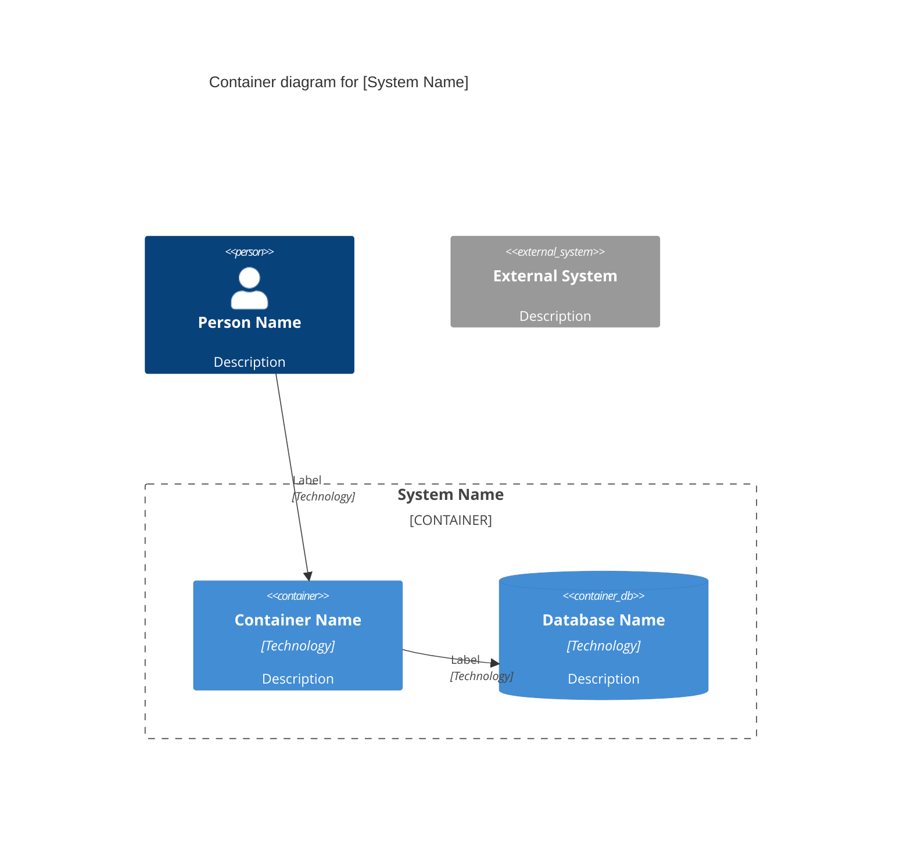
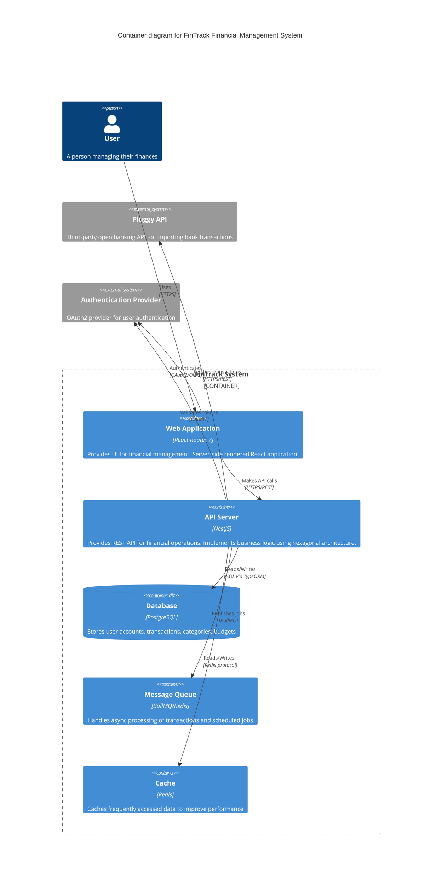
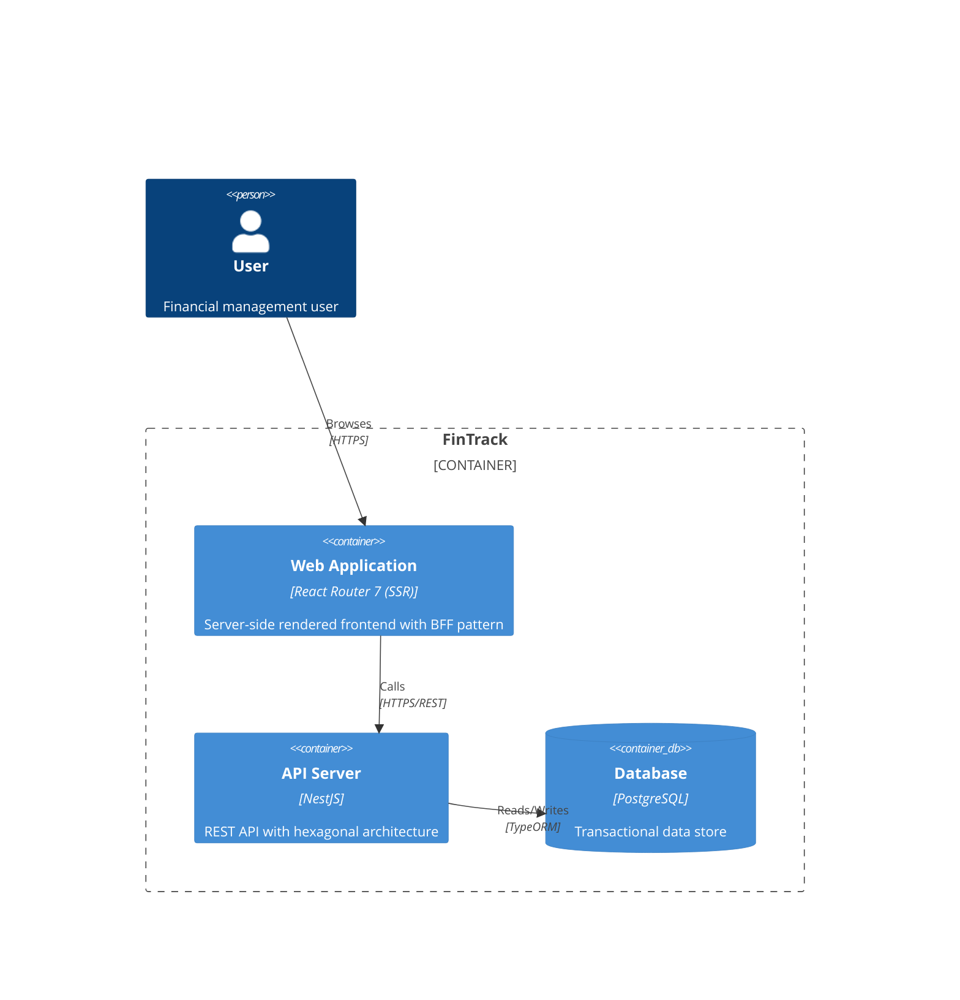
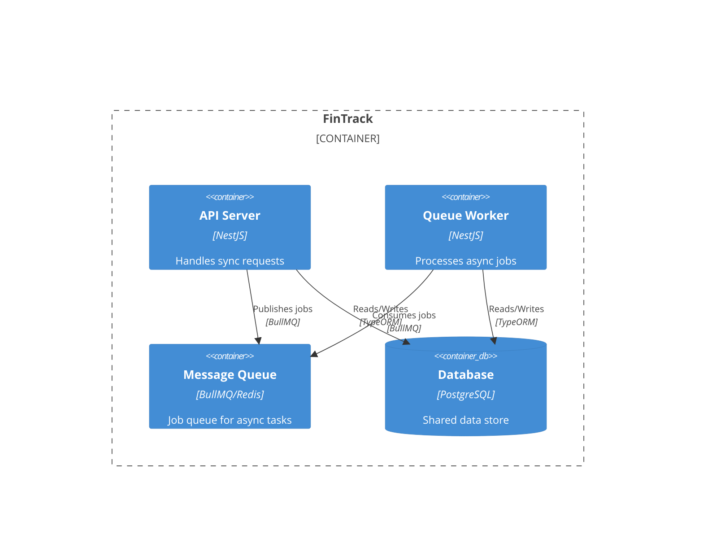
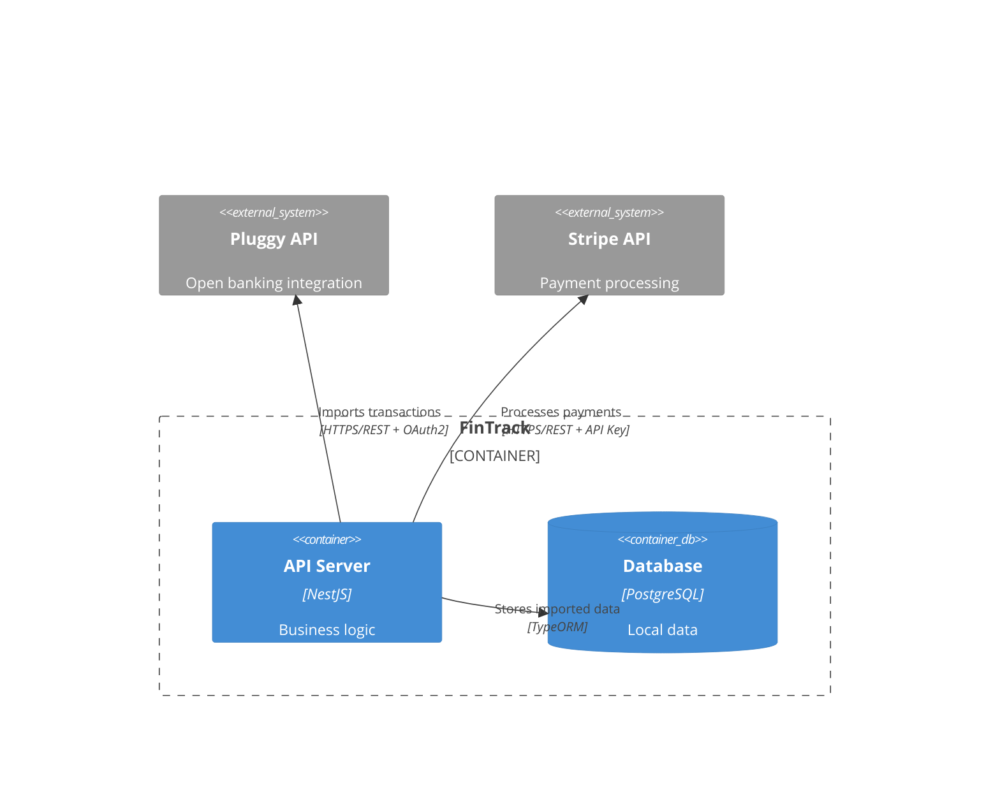
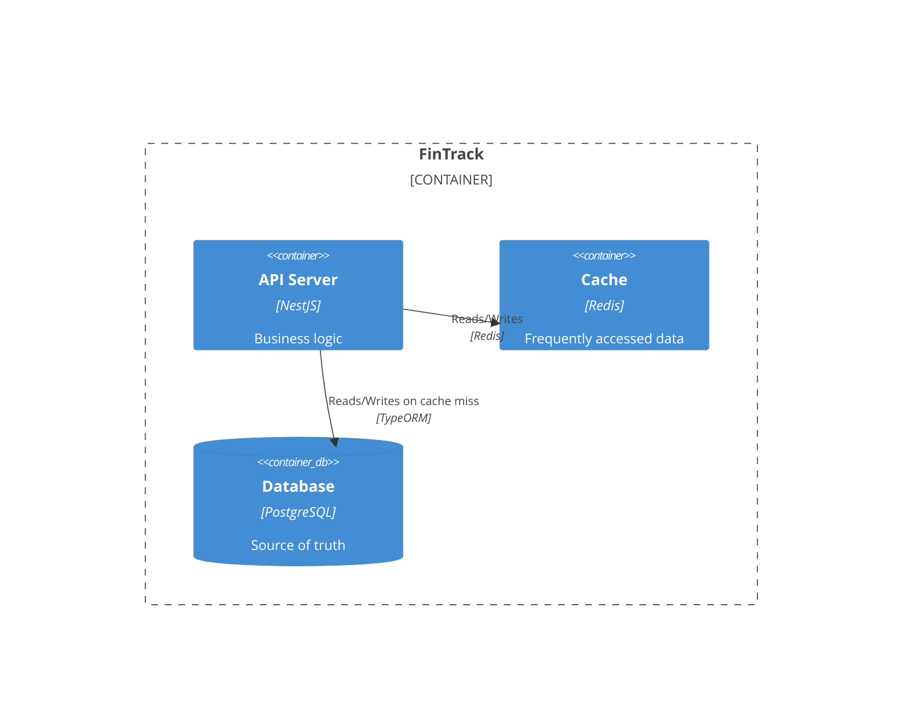
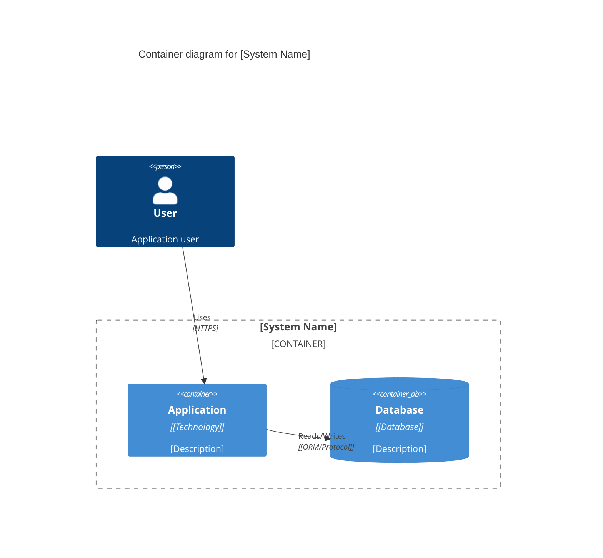
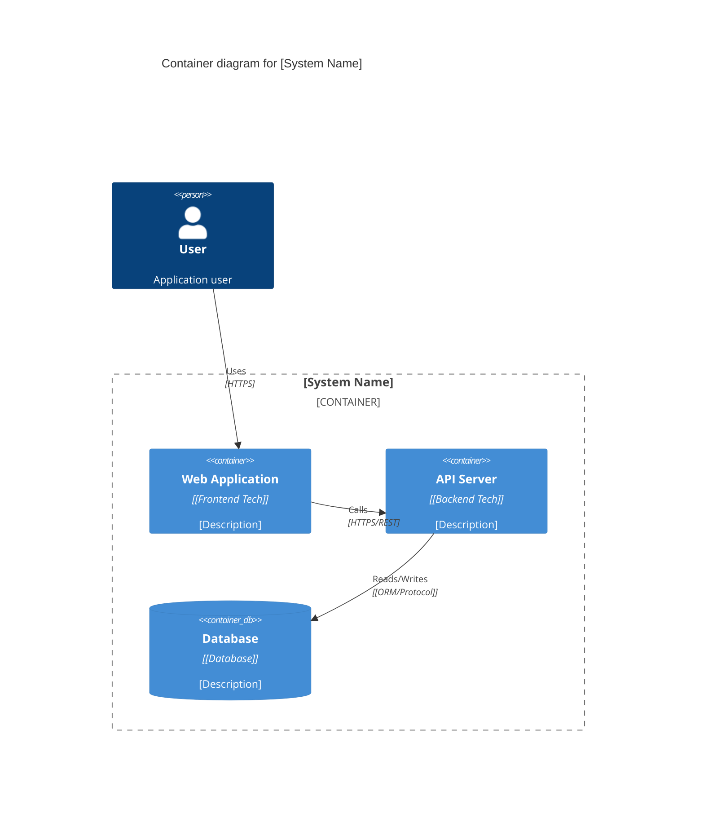
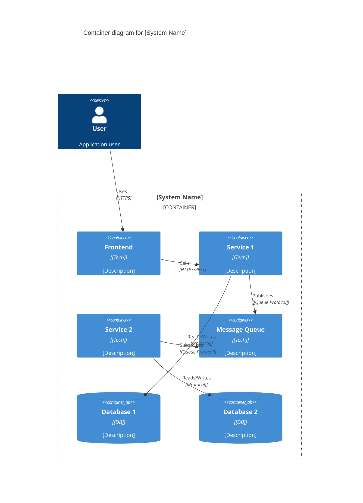
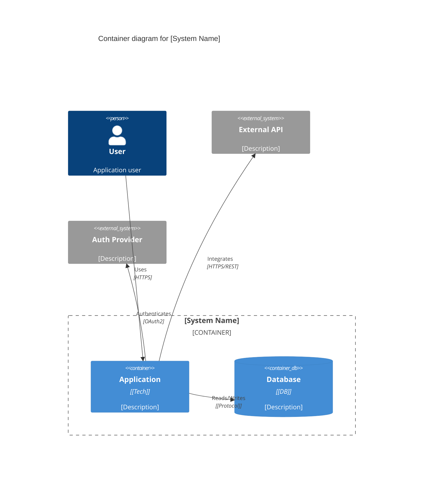

# C4 Container Diagram Best Practices

This guide explains how to create effective C4 Container diagrams for documenting software architecture.

## Overview

**C4 Container diagram** is the second level of the C4 model (Context, Containers, Components, Code). It shows the high-level technology choices and how responsibilities are distributed across applications and data stores.

**Purpose:**
- Show the high-level shape of the software architecture
- Communicate technology choices
- Visualize how containers communicate
- Identify deployment units

**Audience:**
- Software developers
- Architects
- Operations/DevOps teams
- Technical stakeholders

**Reference:** [c4model.com/diagrams/container](https://c4model.com/diagrams/container)

---

## What is a "Container"?

In C4, a **container** is NOT a Docker container. It's a **deployable/runnable unit** that executes code or stores data.

### Containers Include:
- **Server-side web applications** (NestJS API server)
- **Client-side web applications** (React SPA, React Router SSR app)
- **Desktop applications** (Electron app)
- **Mobile apps** (iOS app, Android app)
- **Serverless functions** (AWS Lambda)
- **Databases** (PostgreSQL, MongoDB)
- **File systems** (S3 bucket, file share)
- **Message queues/brokers** (RabbitMQ, Kafka, BullMQ)
- **Caches** (Redis)
- **Microservices** (Each service is a container)

### Containers Do NOT Include:
- ❌ Docker containers (that's infrastructure/deployment, not architecture)
- ❌ Libraries or frameworks (those are components/code)
- ❌ Functions or classes (those are code)

---

## Container Diagram Structure

### Elements

#### 1. People (External Actors)
Users who interact with the system.

**Examples:**
- End user
- Administrator
- External system user
- API consumer

#### 2. Containers (Within System Boundary)
Applications and data stores within your system.

**For each container, show:**
- **Name** - e.g., "API Server", "Web Application"
- **Type** - e.g., "NestJS Application", "React Router 7 App", "PostgreSQL Database"
- **Description** - Brief purpose (1-2 sentences)

#### 3. External Systems
Systems outside your control that you integrate with.

**Examples:**
- Third-party APIs (Stripe, Pluggy, Auth0)
- Legacy systems
- Other teams' systems

#### 4. Relationships (Communication Paths)
Lines showing how containers communicate.

**For each relationship, show:**
- **Direction** - Arrow from source to target
- **Description** - What the communication is (e.g., "Makes API calls", "Reads/writes")
- **Protocol/Technology** - e.g., "HTTPS/REST", "WebSocket", "SQL"

---

## C4 Container Diagram Template (Mermaid)

### Basic Structure



### FinTrack Example



---

## Best Practices for Container Diagrams

### 1. Scope: Single Software System

**Show:**
- All containers within your system boundary
- External systems directly connected to your system
- People who use your system

**Don't show:**
- Internal components (save for Component diagram)
- Infrastructure details (save for Deployment diagram)
- Other systems not directly connected

### 2. Technology Choices Matter

**Always specify technology:**
✅ "API Server - NestJS"  
✅ "Database - PostgreSQL"  
✅ "Web App - React Router 7 (SSR)"

❌ "API Server"  
❌ "Database"  
❌ "Web App"

**Why:** Technology choices are architectural decisions that stakeholders need to see.

### 3. Show Communication Protocols

**Label relationships with protocols:**
✅ "HTTPS/REST"  
✅ "WebSocket"  
✅ "gRPC"  
✅ "Message Queue (BullMQ)"  
✅ "SQL via TypeORM"

❌ "Uses"  
❌ "Calls"  
❌ "Connects to"

**Why:** Protocol choices affect performance, scalability, and operational complexity.

### 4. Use Clear Descriptions

**For each container:**
- What does it do?
- Why does it exist?
- What's its key responsibility?

**Good descriptions:**
✅ "Provides REST API for financial operations. Implements business logic using hexagonal architecture."  
✅ "Handles async processing of transactions and scheduled jobs"  
✅ "Server-side rendered React app for financial management UI"

**Bad descriptions:**
❌ "API"  
❌ "Queue"  
❌ "Web"

### 5. Group Containers with System Boundary

**Use `Container_Boundary` to show system ownership:**

```mermaid
Container_Boundary(fintrack, "FinTrack System") {
    Container(web, "Web App", "React Router 7", "...")
    Container(api, "API Server", "NestJS", "...")
}
```

**Why:** Makes clear what's inside vs outside your system.

### 6. Distinguish Databases and Queues

**Use specific shapes:**
- `ContainerDb()` for databases
- `Container()` for applications, queues, caches

```mermaid
ContainerDb(db, "Database", "PostgreSQL", "...")
Container(queue, "Message Queue", "BullMQ", "...")
Container(cache, "Cache", "Redis", "...")
```

### 7. Show Key External Dependencies

**Include external systems you integrate with:**
- Third-party APIs
- Auth providers
- Payment gateways
- Legacy systems

```mermaid
System_Ext(pluggy, "Pluggy API", "Open banking integration")
System_Ext(stripe, "Stripe", "Payment processing")
```

**Why:** External dependencies are risks and need visibility.

### 8. Direction of Relationships

**Arrows show who initiates:**
- `Rel(web, api)` - Web app calls API
- `Rel(api, db)` - API reads/writes database

**Bi-directional when needed:**
- `BiRel(web, api)` - WebSocket (both directions)

### 9. Keep it High-Level

**Don't include:**
- ❌ Internal components (e.g., "UserController", "TransactionService")
- ❌ Deployment details (e.g., "Load Balancer", "Kubernetes Pod")
- ❌ Infrastructure (e.g., "VPC", "Subnet")

**Focus on:**
- ✅ Deployable units (applications, services)
- ✅ Data stores (databases, caches)
- ✅ Message queues/event streams
- ✅ Technology choices

---

## FinTrack-Specific Patterns

### Pattern 1: React Router SSR + NestJS API



**Key Points:**
- Web app is SSR (different from client-side SPA)
- Web app acts as BFF (Backend for Frontend)
- API follows hexagonal architecture

### Pattern 2: Async Processing with Queues



**Key Points:**
- Separate worker process for async jobs
- Queue decouples API from worker
- Both share same database

### Pattern 3: Third-Party Integrations



**Key Points:**
- External systems are `System_Ext`
- Show auth mechanism (OAuth2, API Key)
- Show data flow direction

### Pattern 4: Caching Layer



**Key Points:**
- Cache sits between API and DB
- Show cache read/write pattern
- DB is still source of truth

---

## Common Mistakes to Avoid

| Mistake | Problem | Fix |
|---------|---------|-----|
| **Too detailed** | Including classes, functions, components | Move to Component diagram or remove |
| **Not enough detail** | Just "API" without technology | Specify "API Server - NestJS" |
| **Missing protocols** | No info on how things communicate | Add "HTTPS/REST", "WebSocket", etc. |
| **Infrastructure in diagram** | Load balancers, K8s pods, VPCs | Move to Deployment diagram |
| **No system boundary** | Can't tell what's inside vs outside | Use `Container_Boundary()` |
| **Missing external systems** | Only showing internal containers | Add `System_Ext()` for third-parties |
| **Vague descriptions** | "Handles requests" | "Provides REST API for transaction management" |
| **No database shape** | Database shown as regular container | Use `ContainerDb()` for databases |

---

## When to Create Container Diagrams

### Create Container Diagram When:
✅ Starting a new project (to communicate architecture)  
✅ Adding significant new containers (new service, database)  
✅ Changing technology stack (migrating from X to Y)  
✅ Onboarding new team members  
✅ Documenting technical investigations  
✅ Preparing for Risk Storming sessions  

### Don't Need Container Diagram When:
❌ Making small code changes within existing containers  
❌ Changing UI only (no architecture change)  
❌ Adding new features within existing containers  

---

## Container Diagram Checklist

### Before Drawing
- [ ] Understand the system scope (what's inside the boundary)
- [ ] Identify all deployable units (apps, services, databases)
- [ ] List external systems we integrate with
- [ ] Note technology choices made

### While Drawing
- [ ] Use `Container_Boundary()` for system boundary
- [ ] Use `ContainerDb()` for databases
- [ ] Use `System_Ext()` for external systems
- [ ] Include technology for every container (e.g., "NestJS", "PostgreSQL")
- [ ] Add protocols to relationships (e.g., "HTTPS/REST")
- [ ] Write clear descriptions (1-2 sentences)
- [ ] Show only containers, not components
- [ ] Include key external dependencies

### After Drawing
- [ ] Review with team: "Does this match our architecture?"
- [ ] Validate external systems: "Are we missing any integrations?"
- [ ] Check technologies: "Are these accurate?"
- [ ] Verify scope: "Is this just containers, or did we include components?"

---

## C4 Model Hierarchy Recap

**When to use each level:**

### Level 1: System Context Diagram
- **Scope:** System in the context of other systems
- **Shows:** Your system + external systems + users
- **Use when:** Understanding how system fits in the ecosystem

### Level 2: Container Diagram ⭐ (This Guide)
- **Scope:** Single system, showing deployable units
- **Shows:** Applications, databases, queues, caches, external systems
- **Use when:** Communicating high-level architecture and technology choices

### Level 3: Component Diagram
- **Scope:** Single container, showing internal structure
- **Shows:** Controllers, services, repositories, domain logic
- **Use when:** Designing internal structure of a container

### Level 4: Code Diagram
- **Scope:** Single component, showing classes/functions
- **Shows:** Class diagrams, sequence diagrams
- **Use when:** Detailed design or IDE-generated diagrams

**Most useful for technical investigations: Level 2 (Container Diagram)**

---

## Templates for Common Scenarios

### Template 1: Monolith with Database



### Template 2: Frontend + Backend + Database



### Template 3: Microservices with Message Queue



### Template 4: With External Integrations



---

## Additional Resources

- **C4 Model Official Site:** [c4model.com](https://c4model.com/)
- **Container Diagram Page:** [c4model.com/diagrams/container](https://c4model.com/diagrams/container)
- **Mermaid C4 Syntax:** [mermaid.js.org/syntax/c4.html](https://mermaid.js.org/syntax/c4.html)
- **Book:** "Software Architecture for Developers" by Simon Brown (creator of C4)

---

## Summary

**Container diagrams show:**
- ✅ High-level architecture shape
- ✅ Technology choices (NestJS, PostgreSQL, Redis)
- ✅ Communication protocols (HTTPS/REST, WebSocket, SQL)
- ✅ System boundaries (what's inside vs outside)
- ✅ External dependencies (third-party APIs)

**Container diagrams don't show:**
- ❌ Internal components (controllers, services)
- ❌ Infrastructure (load balancers, Kubernetes)
- ❌ Deployment details (servers, containers, pods)
- ❌ Code-level details (classes, functions)

**Use container diagrams for:**
- Technical investigation workshops
- Risk Storming sessions (to map risks visually)
- Onboarding documentation
- Architecture decision records (ADRs)
- Stakeholder communication
